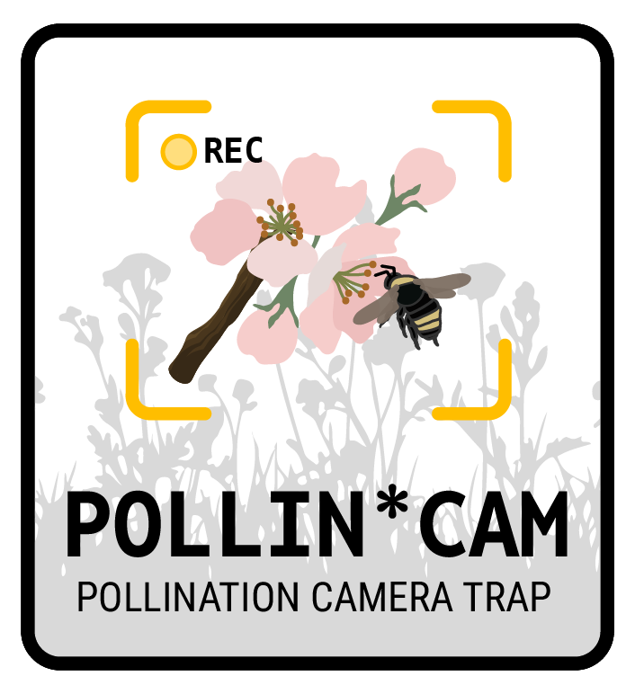
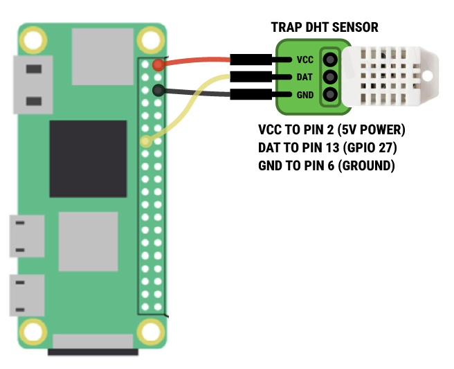

<div align="center">

</div>

# Autonomous plant-pollinator camera trap for research

This repo contains the code to standup a prototype plant-pollinator camera trap for remote, field-based surveys of pollinator visitation to wild or cultivated plants and other related research. 

# Components and build instructions

| Component | Description | Documentation |
| :---- | :---- | :---- |
| **1\.** Raspberry Pi Zero 2W | Microcontroller that manages camera imaging and environmental sensors | n/a |
| **2\.** MakerSpot USB hub | Multi-port USB hub for thumb drive and camera interface | n/a |
| **3\.** WittyPi 4 Mini RTC | Real-time clock that controls scheduled startup and shutdown | [Link to documentation](https://www.uugear.com/doc/WittyPi4Mini_UserManual.pdf) |
| **4\.** USB thumb drive | External drive for image storage | n/a |
| **5\.** Arducam IMX219 camera | Autofocus camera unit for imaging bumble bees visiting the trap | [Link to documentation](https://www.uctronics.com/download/Amazon/B029201_Maunal.pdf%20)  |
| **6\.** DHT22 temp/humid sensor | Temperature/humidity sensor for environmental conditions at the trap | n/a |
| **7\.** Voltaic V75 + panel | Solar-fed battery to power camera trap | | 
| **8\.** Outdoor junction box | Waterproof housing for battery and Pi. | | 


# Raspberry Pi setup and configuration
Prototype trap deployed | Trap imaging surface
:-------------------------:|:-------------------------:
 |  

## 1. Physical setup 🏗️
1. Solder (or use hammer-header) GPIO pin header to the Pi.
2. Attach stacking header and then Witty Pi 4 mini on top of that
3. Mount the USB hub, ensuring the Pogo pins are correctly aligned (see [here](https://makerspot.com/stackable-usb-hub-for-raspberry-pi-zero/) for instructions.
4. Plug in the USB thumb drive to any of the USB ports on the hub.

## 2. Operating system and software 💿
### Imaging MicroSD card
Use the Raspberry Pi Imager software to install the recommended operating system for the Raspberry Pi Zero 2W on the microSD card, but opt for the *32-bit* version of Debian Trixie for this particular iteration of the camera trap to save memory.

For customizations, you will need to define:

1. Hostname: use `pollincam-XX` Replace the `XX` with the next sequence of defined in the lab pi asset tracking spreadsheet.
2. Username: use `ibuglab`
3. Password: use standard lab password for devices (see asset tracking spreadsheet)
4. WiFi network: use either personal hotspot or local network that you have full access to (we can later swap to Eduroam or other networks). If neither hotspot or local network is available, leave blank for now and manually configure using keyboard/mouse/monitor after completing the rest of this guide.
5. Enable SSH using password authentication (this is to enable remote access using the device password above)
6. Enable Raspberry Pi Connect (additional remote access capabilities including screen sharing). You will need to open and sign in to our lab's Raspberry Pi connect account in order to obtain the authentication token. Account details are in the iBUG Pi asset spreadsheet.

### Updates and dependency installation
Once the microSD card is flashed with the OS, install it in the Pi and boot it up. If the Pi is auto-connecting to available hotspot or wifi, login to Raspberry Pi Connect and then login to the device using a remote shell connection (i.e., terminal window). If the device is not on the network, use a keyboard/mouse and monitor to open a terminal window and execute the following:

```bash
sudo apt update
sudo apt upgrade
```
Accept upgrade installations and wait for the device to update fully. This may take 5-15 minutes. Once complete, `sudo reboot` to reboot the Pi. Once the Pi has rebooted, open a terminal and then install the requisite programs/packages needed:

```bash
# GUI for managing disk devices/partitions
# Install this first
sudo apt-get install gparted

# Then run this section of code
sudo apt install -y \
python3-flask \
python3-numpy \
v4l-utils \
python3-opencv

# Then run this
pip3 install imutils
```

## 3. Witty Pi 4 mini configuration 🔋

```bash
wget https://www.uugear.com/repo/WittyPi4/install.sh
sudo sh install.sh
```

After the installation, we'll setup the web interface to adjust the schedule for startup/shutdown. 

```bash
sudo home/ibuglab/uwi/diagnose.sh
```

This will configure the web interface and provide the URL to access the Witty Pi device and enter the scheduling information. Once you have accessed the Witty Pi UI, select "Schedule Script" and paste in:

```
# Define start and end to schedule
BEGIN 2026-06-01 06:00:00
END   2035-12-31 20:00:00

ON  H14 # On for 14 hours
OFF H10 # Off for 10 hours

```

Click save, and then refresh the UI. You should now see the `Next Shutdown` and `Next Startup` with a time of 20:00 of the current day (for Next Shutdown) and 06:00 for the next day (for Next Startup). 

Next, set the low voltage setting to 3V. This ensures that the Pi gracefully shuts down if/when the battery is drained and voltage begins to drop. 

## 4. External hard drive configuration (USB thumb-drive) 💽
### Using terminal:

The USB thumb drive we use contains 500gb of space where we will store all of our captured images. We'll first reformat/re-partition the drive and then modify a script to ensure the drive automounts each time the Pi boots up in the morning. 

First, confirm what the external drive is: 

```bash
lsblk
```

It *should* be `/dev/sda` (500GB disk) that has a single partition in it. Next, we'll delete the existing partitions and create a new one:

```bash
sudo parted -s /dev/sda mklabel gpt
sudo parted -s /dev/sda mkpart primary ext4 0% 100%

# adjust `pollincam-01` with appropriate unit name/number
sudo mkfs.ext4 -L pollincam-01 /dev/sda1 
```

Now we'll create a mount point on the Pi for the device. Adjust the `pollincam-01` name a number appropriately. 

```bash
sudo mkdir -p /mnt/pollincam-01
```

Next, we'll add the device to to a file so that it automatically mounts upon startup. From this, copy the UUID of the device. The output will look like: `/dev/sda1: UUID="1234abcd-5678-efgh-9012-ijkl34567890" TYPE="ext4"`

```bash
sudo blkid /dev/sda1
sudo nano /etc/fstab

# To the fstab file, add this at the bottom (adjust UUID to match)
UUID=1234abcd-5678-efgh-9012-ijkl34567890  /mnt/pollincam-01  ext4  defaults,nofail  0  2
```

Save and exit the fstab file, and then test the mount:

```bash
sudo mount -a
df -h

# Should see: /dev/sda1       500G  1G  499G   1% /mnt/pollincam-01
```

### Using Gparted
Launch screen sharing to the device via Raspberry Pi Connect...

## 5. Clone Github repository to the Pi
Now we'll clone this repo to the Pi so that we have the requisite scripts to test and run both the DHT22 sensor (`dht22.py`) and camera trap script (`pollincam.py`).

```bash
git clone https://github.com/ibug-lab/pollin-cam.git
```

This will create a directory (folder) inside our home folder called `pollin-cam` where our scripts will be housed. 

## 6. DHT22 configuration 🌡️
The DHT22 is a temperature/humidity sensor to record environmental conditions at the trap. To configure it, first ensure that the sensor is correctly installed on the GPIO pins of the Pi (see diagram below). 

<div align="center">

</div>

Next, open a terminal and install the necessary dependencies and initialize a python virtual environment to run the `dht22.py` script. 

```bash
sudo apt install -y \
python3-venv \
python3-dev \
build-essential \
swig \
liblgpio-dev

python3 -m venv /home/ibuglab/dht-env
source /home/ibuglab/dht-env/bin/activate

pip install lgpio
pip install adafruit-blinka
pip install adafruit-circuitpython-dht
python home/ibuglab/pollin-cam/dht22.py # this starts the script
```

## 7. Setup CRONTAB events for all camera trap scripts 📅
Using the Witty Pi will start up and shutdown the Pi automatically to save on battery overnight. Because of this, we'll need to configure our Pi to automatically start our camera trap and temperature/humidity sensor script automatically each time the Pi boots up in the morning. For this, we'll use crontab, which is a job scheduler.

```
crontab -e

# add this line to start the scripts after reboot with a 60 second delay
@reboot sleep 60 && /home/ibuglab/dht-env/venv/bin/python /home/ibuglab/pollincam/dht22.py
@reboot sleep 60 && /usr/bin/python3 /home/ibuglab/pollin-cam/pollincam.py
```

Save and exit the crontab. Our scripts are successfully scheduled to startup as soon as the Pi boots up in the morning (+ a 1 minute delay to ensure the device unit boots).  
